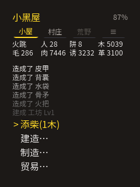
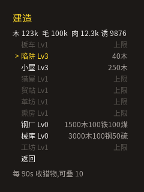
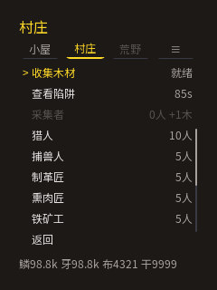
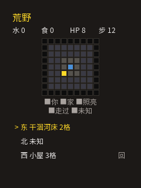
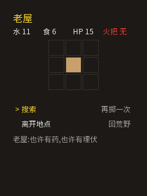
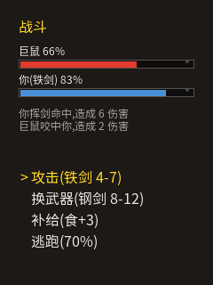
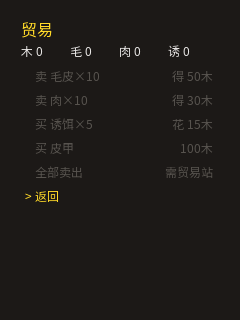
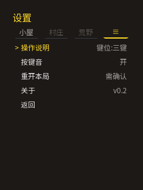
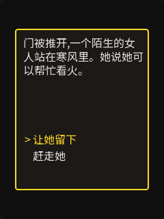

# 小黑屋 — 《A Dark Room》ESP32 完整重制

FoloToy AI Passport(ESP32-C3,240×320 圆屏,三键)上的菜单式文字放置冒险。
参考 [A Dark Room](https://github.com/doublespeakgames/adarkroom) 重制:生火、
收集、建造、招募、交易,然后走向荒野——全部逻辑本地运行,**合盖离线也在推进**。



## 玩法(忠实原版口径,数值见 docs/DESIGN.zh_CN.md §9 源码取证)

- **小黑屋(第一幕)**:点火(5 木)→ 陌生人踉跄入场 → 柴火见底,森林敞开
  → 采集木材(60s,+10/板车+50)→ 造陷阱(90s 查一次,每陷阱必得:
  毛/肉/鳞/牙/布/护符)→ 陌生人在暖房里慢慢恢复,能帮忙后开始建造。
- **村庄**:小屋 ×4 人,流浪者成批到来;职业每 10s 结算——采集者 +1 木、
  猎人 +半毛半肉、捕兽人肉换饵、制革匠 5 毛 1 革、熏肉匠熏干肉。
- **建造**:陷阱 10+10n/板车 30/小屋 100+50n/猎人小屋 200木10毛5肉/
  贸易站 400木100毛/制革坊 500木50毛/熏肉房 600木50肉(原版造价)。
- **贸易**:游牧商人**只买不卖**——以毛皮/鳞/牙换铁、煤、钢、子弹、罗盘。
- **离线结算**:合盖再回,火焰熄灭、陷阱收获、村庄产出按离线时长一次补算
  (8 小时封顶,超出部分 25% 折算)。

## 页面一览

| | | |
| --- | --- | --- |
|  |  |  |
| 标题 | 主页(渐隐日志) | 建造(缺口提示) |
|  |  |  |
| 村庄(收入总览) | 荒野地图 | 废村 |
|  |  |  |
| 战斗 | 贸易 | 设置 |
|  |  | |
| 事件弹窗 | 确认弹窗 | |

## 操作(上 / 下 / 确定三键)

| 手势 | 行为 |
| --- | --- |
| 上 / 下 | 移动焦点(循环;锁定或资源不足的行自动跳过) |
| 确定单击 | 执行 / 进入 |
| 确定长按 | 返回上一级;危险操作 = 打开确认弹窗 |
| 主页顶行按上 | 进入页签导航(未解锁的页签自动跳过) |
| 村庄·确定 | 进入人数调节(上加下减,长按=±5,确定=完成) |

完整规则见 [docs/CONTROLS.zh_CN.md](docs/CONTROLS.zh_CN.md)。

## 构建与烧录

需要 ESP-IDF v5.5.3(Windows 下注意清掉 `MSYSTEM` 环境变量再 `export.bat`):

```bash
idf.py build                # 编译
idf.py -p COM3 flash        # 烧录(应用分区 @0x10000)
```

> **升级不丢档**:老玩家升级请用上面这条(只写应用分区,NVS 存档保留,
> 旧版存档自动迁移)。下面合并镜像会连 NVS 一起覆盖,**仅用于首装/救砖**。

合并镜像(整片刷新,写 0x0):

```bash
idf.py merge-bin -o build/FoloToy-AI-Passport-full.bin
python -m esptool --chip esp32c3 -p COM3 -b 460800 \
    --before default_reset --after hard_reset \
    write_flash 0x0 build/FoloToy-AI-Passport-full.bin
```

## 主机模拟器(无硬件开发)

```bash
bash tools/sim/build_dark_sim.sh                 # 编译(LVGL 全源码 + 游戏代码)
tools/sim/sim_dark.exe "ok@50,down@62" 100 out.bmp   # 按键脚本 + 帧数 + 输出
SIM_PAGE_SWEEP=1 tools/sim/sim_dark.exe "" 600 sweep.bmp  # 全页面轮播截图
```

按键脚本格式 `键@帧号`(ok/up/down),虚拟时钟每帧 +30ms。

## 测试

游戏逻辑(规则/存档/事件)是纯 C99,带主机测试:

```bash
bash tests/run_tests.sh
```

## 文档

- [DESIGN.zh_CN.md](DESIGN.zh_CN.md) — 总体设计
- [docs/GAMEPLAY.zh_CN.md](docs/GAMEPLAY.zh_CN.md) — 四幕玩法与数值口径
- [docs/CONTROLS.zh_CN.md](docs/CONTROLS.zh_CN.md) — 三键操作体验(实装口径)
- [docs/IMPLEMENTATION_STATUS.zh_CN.md](docs/IMPLEMENTATION_STATUS.zh_CN.md) —
  实现进度与缺漏清单(里程碑排期口径)

## 改动界面文案后

字库是按源码字符串字面量生成的闭集,改完文案需要重新生成
(`npx lv_font_conv`,详见脚本内注释):

```bash
bash tools/gen_fonts.sh
```
